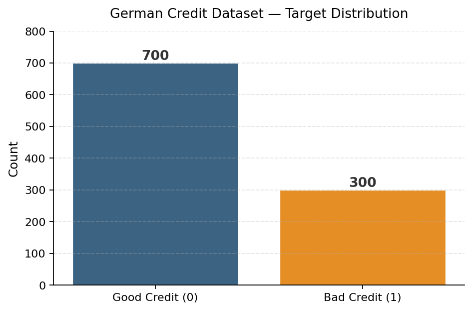
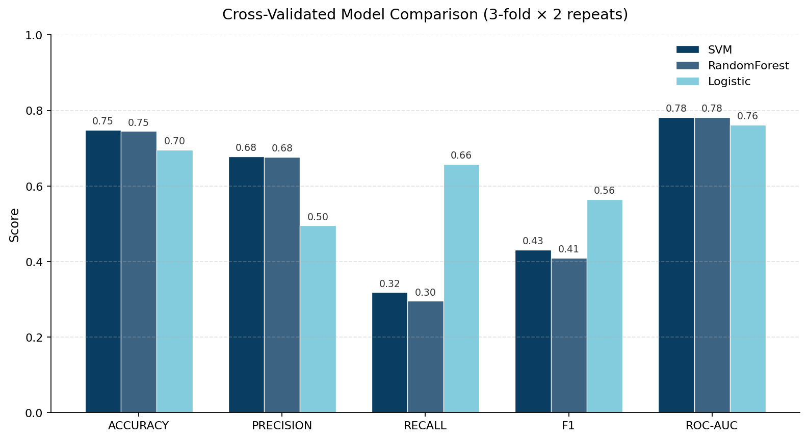
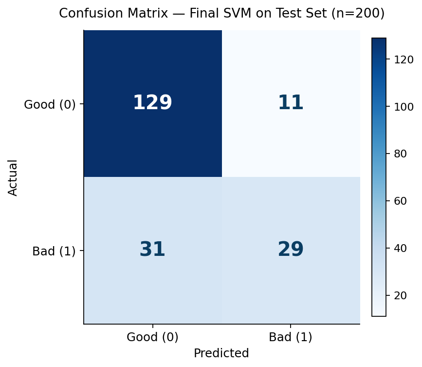

<a href="../index.html#projects" class="proj-back">← Back to Projects</a>

  
// Project 02 · Machine Learning · Classification

  <h1>Credit Risk Classification German Credit Dataset</h1>
  

    A clean, end-to-end scikit-learn pipeline that predicts whether a loan
    applicant is a credit risk. Compares Logistic Regression, Random Forest, and
    SVM with repeated stratified cross-validation across five metrics, and
    discusses the recall trade-off that matters most when the cost of a missed
    bad loan is asymmetric.
  

  

    Python
    scikit-learn
    Pandas
    Pipelines
    Cross-Validation
    Classification
  

  

    
1,000

    
Loan applications · 70/30 class split

  

  

    
3

    
Models benchmarked end-to-end

  

  

    
0.782

    
Best CV ROC-AUC (SVM)

  

  

    
79%

    
Final test accuracy

  

## Problem framing

Credit risk classification is a textbook supervised learning problem with a
non-textbook business consideration: the **cost of the two error types is not
symmetric**. Approving a bad loan (false negative) is materially more expensive
than rejecting a good one (false positive). That makes raw accuracy a poor
single-metric optimizer — recall on the minority "bad credit" class and
ROC-AUC are the more honest scorecards.

The goal of this project was to:

1. Build a reproducible, leakage-free preprocessing + modeling pipeline.
2. Benchmark three model families across five metrics with proper CV.
3. Pick a final model based on the right metric for the business, not the
   highest accuracy.

## Dataset

The classic UCI **German Credit** dataset (1,000 observations, 20 features —
mix of numeric and categorical) loaded directly from a public mirror:

url = "https://raw.githubusercontent.com/selva86/datasets/master/GermanCredit.csv"
df = pd.read_csv(url)

The published target encoding is `1 = good, 0 = bad`, which is unintuitive for
"risk" — a bigger number should mean more risk. I flipped it so `1 = bad`
(positive class = the thing we want to detect):

df["credit_risk"] = df["credit_risk"].map({1: 0, 0: 1})

That puts the class distribution at 700 good / 300 bad — a meaningful but not
extreme imbalance.

<figure class="slide-figure">
  
  <figcaption>Class distribution after target re-encoding — 70/30 split between good and bad credit.</figcaption>
</figure>

## Pipeline design

I used a single `Pipeline` per model so that all preprocessing happens *inside*
each CV fold — no leakage from the test fold into the scaler or one-hot
encoder.

numeric_cols     = X.select_dtypes(include=np.number).columns
categorical_cols = X.select_dtypes(include="object").columns

preprocessor = ColumnTransformer([
    ("num", StandardScaler(),                              numeric_cols),
    ("cat", OneHotEncoder(handle_unknown="ignore"),        categorical_cols),
])

models = {
    "Logistic":     LogisticRegression(max_iter=1000, class_weight="balanced"),
    "RandomForest": RandomForestClassifier(n_estimators=100, class_weight="balanced"),
    "SVM":          SVC(probability=True),
}

A few deliberate design choices:

- **`class_weight="balanced"`** on Logistic and RF to push them to actually try
  on the minority class, instead of collapsing to the majority-class predictor.
- **`handle_unknown="ignore"`** on the OHE — protects against unseen categories
  in test folds.
- **`stratify=y`** in the train/test split — preserves the class ratio.

## Cross-validation

`RepeatedStratifiedKFold(n_splits=3, n_repeats=2, random_state=42)` — six total
folds, stratified, evaluated on five metrics simultaneously:

scoring = ['accuracy', 'precision', 'recall', 'f1', 'roc_auc']
scores  = cross_validate(pipeline, Xtrain, ytrain, cv=cv,
                         scoring=scoring, n_jobs=-1)

## Results — model comparison

<table class="results-table">
<thead>
<tr><th>Model</th><th>Accuracy</th><th>Precision</th><th>Recall</th><th>F1</th><th>ROC-AUC</th></tr>
</thead>
<tbody>
<tr class="best"><td>SVM</td><td>0.748</td><td>0.678</td><td>0.319</td><td>0.431</td><td>0.782</td></tr>
<tr><td>Random Forest</td><td>0.745</td><td>0.677</td><td>0.296</td><td>0.409</td><td>0.782</td></tr>
<tr><td>Logistic Regression</td><td>0.696</td><td>0.495</td><td>0.658</td><td>0.565</td><td>0.762</td></tr>
</tbody>
</table>

<figure class="slide-figure">
  
  <figcaption>Cross-validated metrics across five scorers. Note the recall axis — Logistic Regression dominates there.</figcaption>
</figure>

::: {.callout-box}
**The headline result is not the headline.** SVM and Random Forest win on
accuracy, precision, and ROC-AUC. But Logistic Regression wins decisively on
**recall** (0.658 vs. ~0.30) and **F1** — exactly the metrics that matter when
the bad class is the one you're trying to catch.
:::

## Final model — SVM on the test set

The notebook selects on ROC-AUC and ships SVM, evaluated on the held-out test
set (n=200):

              precision    recall  f1-score   support

           0       0.81      0.92      0.86       140
           1       0.72      0.48      0.58        60

    accuracy                           0.79       200
   macro avg       0.77      0.70      0.72       200
weighted avg       0.78      0.79      0.78       200

<figure class="slide-figure">
  
  <figcaption>Final SVM confusion matrix on the test set. 31 bad applicants were missed (false negatives) — the costly error.</figcaption>
</figure>

In plain terms:

- **129 / 140 good loans correctly approved** (92% recall on class 0)
- **29 / 60 bad loans correctly rejected** (48% recall on class 1)
- **31 bad loans approved** by mistake — the most expensive cell in the matrix.

## Discussion

A 79% accuracy SVM looks tidy on a slide, but if a bank deployed this model
as-is it would still approve roughly **half the bad applicants**. The honest
read of the experiment is:

- **Choose by business metric, not default accuracy.** For asymmetric-cost
  problems, recall on the positive class and the precision–recall trade-off at
  a chosen threshold beat any single number.
- **Logistic Regression is the better starting point than the leaderboard
  implies.** Its 0.66 recall vs. SVM's 0.32 means more risky applicants
  flagged, with only a small ROC-AUC penalty.
- **Threshold tuning is the next obvious move.** SVM's `predict_proba` outputs
  let you slide the decision threshold below 0.5 to trade precision for recall
  on class 1 — likely a much bigger win than swapping model families.

### Possible next steps

- Tune the decision threshold on the validation fold (target recall ≥ 0.70).
- Apply SMOTE / `imbalanced-learn` resampling inside the pipeline.
- Add SHAP feature attributions for explainability — required for any real
  credit context.
- Cost-sensitive learning with explicit `(C_FN, C_FP)` weights set by the
  business.

## Resources

- 📥 [Download the source notebook (.ipynb)](files/creditriskproject.ipynb)

  Last Updated: `r format(Sys.time(), "%B %d, %Y")` &nbsp;·&nbsp;
  Javier Bravo Bernal &nbsp;·&nbsp; Built with Quarto &amp; R

